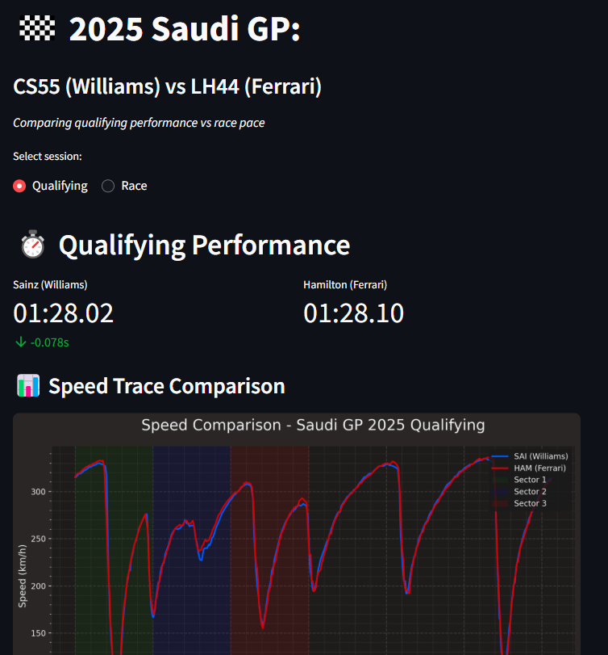

# 🏁 Saudi GP 2025 — F1 Telemetry & Race Strategy Dashboard

This interactive dashboard compares **Carlos Sainz Jr. (Williams)** vs **Lewis Hamilton (Ferrari)** in the 2025 Saudi Arabian Grand Prix — using telemetry, tire strategy, position charts and lap-time degradation.

### 🔍 Features
- Compare **Qualifying Speed Traces**
- Analyze **Race Pace + Tire Strategies**
- Visualize **Position Changes** and **Stint Performance**
- Streamlit-powered UI with simplified & technical insights

---

### 📷 Preview

---

### 🚀 Try It Live  
🔗 [Open Streamlit App](https://yourusername-fastf1saudigp.streamlit.app)

---

### 🛠 Tech Stack
- Python + FastF1
- Matplotlib + Seaborn
- Streamlit + GitHub

---

### ✍️ Insights Sample

#### Qualifying
- Sainz outqualified Hamilton by 0.078s, mostly from straight-line speed
- Ferrari struggled in Sector 3 due to rear traction loss
- Williams benefited from a lower rear wing and higher DRS efficiency

#### Race
- Sainz undercut on Lap 18 and gained 3 positions
- Hamilton suffered medium tire degradation after Lap 15 (lost ~0.8s/lap)
- Sainz closed a +8s gap to just +3s in the final stint

---

🏎️ Built by **Nour ElHout** — aspiring F1 strategist and AI engineer.

